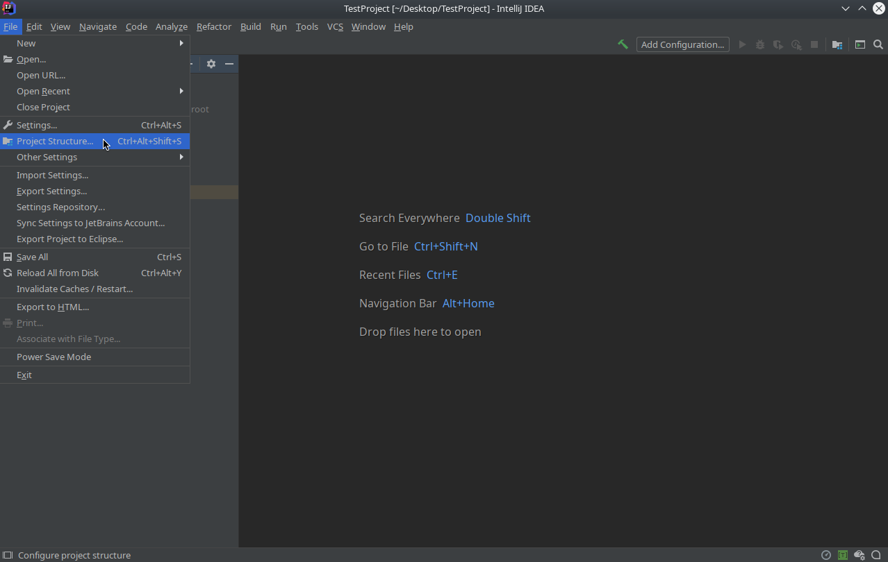
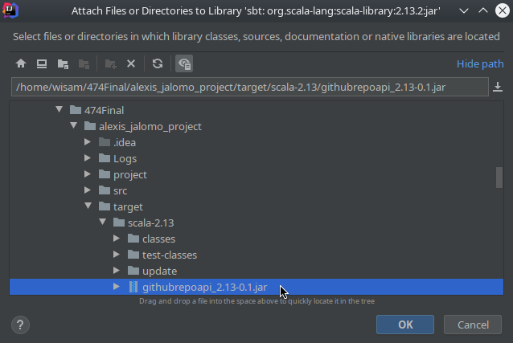

# GraphQL Client Framework for Github
Wisam Abunimeh  
Alex Jalomo  
Jacob Sanchez  
CS474, Spring 2020

## Description

## Commands
### Query Commands

There exist three supported query types for the github’s API. The desired type must be specified during the creation of the Query:

'''
GithubQuery[QueryInfo]().withQueryType(/*Desired Query Type*/)
'''

Query types MyRepos and MyContributedToRepos are relative to the owner of the github authorization key.


## Installation

To use the plugin properly, be sure to have the following software installed:  

* [Java SE Development Kit 11](https://www.oracle.com/java/technologies/javase-jdk11-downloads.html)
* [sbt 1.3.x ](https://www.scala-sbt.org/download.html)
* [Scala  2.13.x](https://www.scala-lang.org/download/) 
* [IntelliJ IDEA](https://www.jetbrains.com/idea/download/)
* GraphQL Client Framework for Github

To install this package into a project:  

1.  Download GraphQL Client Framework for Github

    ```  
    git clone https://bitbucket.org/Jalomo1197/alexis_jalomo_project/
    ```
	
2. Navigate to the project root folder  

    ```
    cd alexis_jalomo_project/  
    ```
    
3. Execute these commands on the command line:

    ```
    sbt clean  
    ```  
    ```
    sbt package
    ```
    
4. Open your project in IntelliJ IDEA and navigate to File → Project Structure  


5. Under the Project Settings tab, select Libraries. Select Add under Standard Library  


6. Navigate to `./alexis_jalomo_project/target/scala-2.13/` and select `githubrepoapi_2.13-0.1.jar`  
  
Apply the changes. The package will now be usable within the user's project.

## Usage

## Testing
To execute the unit tests from the command line, execute the following commands:  

```
cd alexis_jalomo_project/  
sbt clean
sbt compile
sbt test
```
Once the tests has completed, the testing report appears here:  `./alexis_jalomo_project/target/test-reports/index.html` 


## Logging
Log files can be found in the ./alexis_jalomo_projec/Logs directory. Log files follow the log-YYYY-MM-DD.log naming format.

## Open Source Tools
The following open source tools and their documentation were used for this project:  

* [JSON4S](https://github.com/json4s/json4s)
* [Apache HttpComponents](https://hc.apache.org/)
* [Typesafe Config ](https://github.com/lightbend/config)
* [ScalaTest](http://www.scalatest.org/)
* [Logback](http://logback.qos.ch/)
* [Scala Logging](https://github.com/lightbend/scala-logging)
* [Transform](https://transform.tools/json-to-scala-case-class)

## References  
The following resources were used:  

* [GraphQL API v4](https://developer.github.com/v4/) 
* [Stack Overflow](https://stackoverflow.com/)
* [Scala Language Specification](https://scala-lang.org/files/archive/spec/2.11/)
* [Functional Programming in Scala](https://www.oreilly.com/library/view/functional-programming-in/9781617290657/)
* [sbt Reference Manual](https://www.scala-sbt.org/1.x/docs/)
